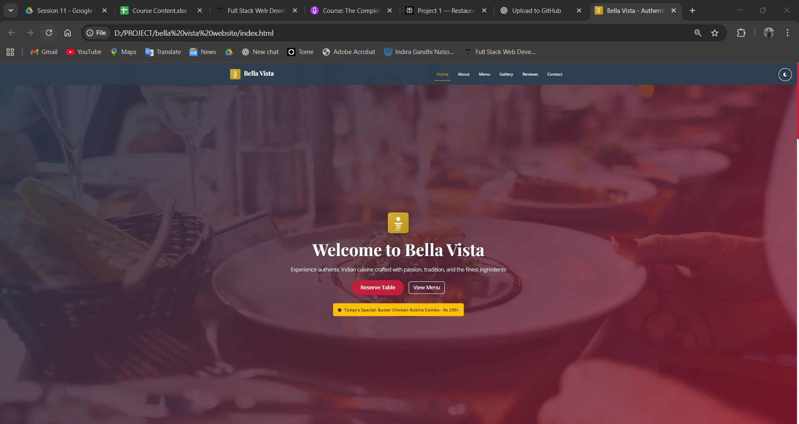

# Bella Vista - Restaurant Landing Page

A fully responsive, single-page marketing site for a fictional Indian restaurant built with HTML, CSS, JavaScript, and Bootstrap.

---

## Bella Vista Restaurant Project Overview

Bella Vista is a professional restaurant landing page that showcases authentic Indian cuisine with a modern, responsive design. The website features smooth scrolling, interactive elements, form validation, dark mode, and accessibility features.

---

## Features

### Must-Have Features ✅

- Hero Section: Logo, tagline, and clear call-to-action buttons
- About Section: Restaurant story with chef photo
- Menu Highlights: 6 signature dishes displayed as responsive cards
- Gallery: Image grid with Bootstrap modal lightbox functionality
- Testimonials: Bootstrap carousel with 5 customer reviews
- Contact & Location: Contact form, address, phone, email, and embedded Google Map
- Footer: Social media icons and opening hours

### Functional Requirements ✅

- Sticky Navigation: Fixed navbar with smooth scrolling and active link highlighting
- Form Validation: JavaScript validation with required fields, email format, and length constraints
- Responsive Design: Mobile-first approach using Bootstrap grid system
- Accessibility: Semantic HTML5 tags, alt text, proper contrast, focus states, and keyboard navigation

---

## Stretch Goals ✅

- Today's Special Badge: Dynamic badge that shows/hides based on the day of the week
- Dark Mode Toggle: Persistent dark mode using localStorage
- SEO Optimization: Meta tags, Open Graph tags, and semantic structure
- Performance Optimization: Image lazy loading, throttled scroll events
- Advanced Accessibility: Skip links, screen reader announcements, keyboard navigation

---

## Technologies Used

- HTML5: Semantic markup with accessibility best practices
- CSS3: Custom properties, Flexbox, Grid, animations, and responsive design
- JavaScript ES6+: Modern JavaScript with modules, async/await, and DOM manipulation
- Bootstrap 5.3: Responsive grid system, components, and utilities
- Font Awesome 6: Icon library for social media and UI elements
- Google Fonts: Playfair Display and Open Sans typography

---

## 📁 Project Structure

```
restaurant-landing-page/
├── index.html              # Main HTML file
├── assets/                 # Media assets
│   └── images/            # Image files
│       ├── favicon.svg       # Restaurant logo
│       ├── chef.jpg       # Chef photo
│       ├── butter-chicken.jpg
│       ├── palak-paneer.webp
│       ├── biryani.jpg
│       ├── masala-dosa.jpg
│       ├── samosas.jpg
│       ├── ice-cream.jpg
│       ├── restaurant-interior.webp
│       ├── dining-area.jpg
│       ├── kitchen.jpg
│       ├── food-preparation.jpg
│       ├── wine-cellar.jpg
│       ├── outdoor-seating.webp
│       └── screenshots/
│           ├── home-page.png
│           ├── about-page.png
│           ├── menu-page.png
│           ├── gallery-page.png (reviews included)
│           ├── contact-page.png (map included)
│           └── form-page.png
├── css/
│   └── custom.css         # Custom CSS styles
├── js/
│   └── main.js           # Main JavaScript file
└── README.md             # Project documentation
```

---

## How to Run Locally

###Prerequisites

- Modern web browser (Chrome, Firefox, Safari, Edge)
- Basic text editor or IDE (VS Code recommended)
- Local web server (optional but recommended)

###Quick Start

1. Clone or Download the Project

   ```bash
   # Download the ZIP file and extract it
   # OR clone if using Git
   git clone [repository-url]
   cd restaurant-landing-page
   ```

2. Option 1: Open Directly in Browser

   - Double-click on `index.html` to open in your default browser
   - Navigate through the sections using the navbar

3. Option 2: Use Local Server (Recommended)

   ```bash
   Using Python (if installed)
   python -m http.server 8000

   Using Node.js live-server (if installed)
   npx live-server

   Using VS Code Live Server extension
   Right-click on index.html → "Open with Live Server"
   ```

4. Access the Website

   - Direct: [Open index.html]`file:///d:/PROJECT/bella%20vista%20website/index.html`
  
---

## Responsive Breakpoints

The website is optimized for all device sizes:

- Mobile: 320px - 576px
- Tablet: 577px - 768px
- Desktop: 769px - 1200px
- Large Desktop: 1201px+

---

## ✅ Browser Compatibility

| Browser | Version | Status |
|---------|---------|--------|
| Chrome  | 90+     | ✅ Full Support |
| Firefox | 85+     | ✅ Full Support |
| Safari  | 14+     | ✅ Full Support |
| Edge    | 90+     | ✅ Full Support |
| IE      | 11      | ❌ Not Supported |

---

## Known Issues

1. Google Maps: Requires API key for production us
2. Form Submission: Currently shows success message only (no backend integration)

---

## Screenshots
   - Homepage
     
      
     
---

